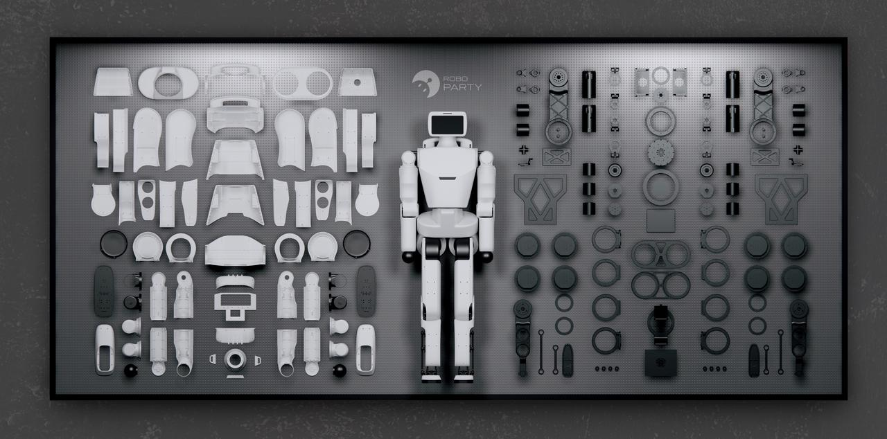
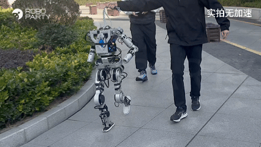
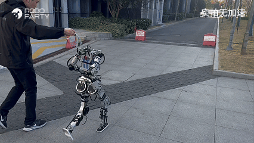
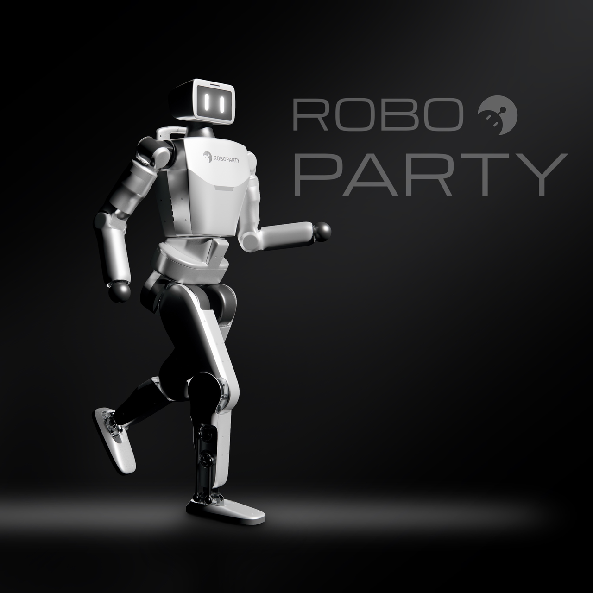

# 萝博头_原型机——全开源手搓级人形机器人

[](https://www.gnu.org/licenses/gpl-3.0) [](https://docs.ros.org/en/humble/index.html) [](https://docs.omniverse.nvidia.com/isaacsim/latest/overview.html) [](https://isaac-sim.github.io/IsaacLab) [](https://docs.python.org/3/whatsnew/3.10.html) [](https://en.cppreference.com/w/C++17) [](https://ubuntu.com/) [](https://github.com/Roboparty) [](https://github.com/leggedrobotics/rsl_rl)

---



**[English](README.md)**

## 关于我们

我们是 **RoboParty**，上海萝博派对科技有限公司，成立于2025年2月21日。四月份我们开始正式做人形机器人，经历四个月完成了原型机的研发，也就是这台萝博头原型机。我们一直秉持着开源的理念，ROBOTO_ORIGIN的全研发流程和全部的结构、电气、训练、部署都进行了开源。

随着我们逐步推进新机器人的研发，我们发现一台高性能的机器人远远不是手搓所能达到的，所以我们决定将这台能跑能跳的原型机正式开源，以记录我们的来时路。

萝博头原型机可以完全通过淘宝采购和嘉立创打样（一键复刻）完成，真正仅靠自己手搓便能完全组装。依靠我们提供的开源训练代码和部署代码，能轻松实现行走跑步的基础功能。后续我们也将逐步把我们在这台机器人上实现的更多算法添加到开源仓库中。在此之上，作为一台全开源机器人，它的功能可以由广大开发者和使用者定义，因此，创意工坊也会稍后上线。

---

## 文档

**[人形机器人Know-How文档](https://roboparty.com/roboto_origin/doc)** - 包含原型机全研发流程介绍

---

## 交流群

**QQ群：** 1078670917

<table>
  <tr>
    <td></td>
  </tr>
  <tr>
    <td align="center"><b>QQ群</b></td>
  </tr>
</table>

---

## 关于本仓库

本仓库为萝博头原型机的核心子仓库的快照，将会每日更新以方便一次拉取全部资源。

**重要说明：** 本仓库 `roboto_origin` 仅作为快照聚合仓库，所有问题反馈和代码贡献应前往对应的子仓库中进行。

### 贡献方式

如果您希望为项目做出贡献，请根据贡献内容选择对应的子仓库：

| 子仓库                                                                    | 贡献方向                                           |
| ------------------------------------------------------------------------- | -------------------------------------------------- |
| **[Atom01_hardware](https://github.com/Roboparty/Atom01_hardware)**       | 机械结构设计、CAD图纸、PCB设计、BOM改进            |
| **[atom01_deploy](https://github.com/Roboparty/atom01_deploy)**           | ROS2驱动开发、中间件模块、部署配置、IMU/电机集成   |
| **[atom01_train](https://github.com/Roboparty/atom01_train)**             | 强化学习算法、训练环境、仿真配置、Sim2Sim迁移      |
| **[atom01_description](https://github.com/Roboparty/atom01_description)** | URDF运动学/动力学描述、视觉/碰撞网格、关节参数优化 |

**详细贡献指南请点击这里：** [CONTRIBUTING_CN.md](CONTRIBUTING_CN.md)

**[机器人BOM表点这里](./assets/BOM.md)**

---

<table>
  <tr>
    <td></td>
    <td></td>
  </tr>
</table>



---

## 资源指引

### 仓库模块

| 模块名称               | 介绍                                                                                              | 仓库链接                                        |
| ---------------------- | ------------------------------------------------------------------------------------------------- | ----------------------------------------------- |
| **Atom01_hardware**    | Atom01机器人的硬件设计文件，包含结构图纸和设计资料                                                | https://github.com/Roboparty/Atom01_hardware    |
| **atom01_deploy**      | ROS2部署框架，提供模块化架构的中间件，用于机器人部署和控制，支持IMU、电机驱动、推理等功能         | https://github.com/Roboparty/atom01_deploy      |
| **atom01_train**       | 基于IsaacLab的直接训练工作流，提供高透明度和低重构难度的强化学习训练环境，支持Sim2Sim迁移到MuJoCo | https://github.com/Roboparty/atom01_train       |
| **atom01_description** | Atom01机器人的URDF模型文件，包含机器人运动学和动力学描述，用于仿真和可视化                        | https://github.com/Roboparty/atom01_description |

---

## 快速开始

```bash
# 克隆仓库
git clone https://github.com/Roboparty/roboto_origin.git

# 更新仓库
git pull
```

进入各模块目录 `modules/...`，按照模块内 README 指引即可。

---

## 行为准则

本项目已采用[行为准则](CODE_OF_CONDUCT_CN.md)来营造欢迎和包容的社区环境。所有贡献者和用户都应遵守这些准则。

**[Code of Conduct](CODE_OF_CONDUCT.md)**


---

## 免责声明

### 开源软件授权与免责协议

本软件按"原样"提供，不提供任何形式的担保，无论是明示还是暗示，包括但不限于对适销性、特定用途适用性和非侵权性的担保。

**硬件耦合免责：** 本软件输出的指令在物理硬件上执行，由此在物理世界产生的任何后果均由硬件操作者全权负责。本软件仅作为"辅助工具"，操作权完全在用户手中。在任何情况下，作者或版权持有者均不对任何索赔、损害或其他责任承担责任，无论是在合同诉讼、侵权诉讼还是其他诉讼中，因软件或与软件的使用或其他交易而产生、引起或与之相关的。

### 二次开发用户协议

对于用户使用、修改、改编、改进、二次开发、运行、分发或以其他任何方式使用开源组件的行为，用户同意承担全部责任。**萝博派对不承担任何责任。**

使用、修改或分发本软件，即表示您确认理解并同意承担与此类行为相关的所有风险，包括但不限于：
- 机器人运行造成的人身伤害或财产损失
- 因参数配置不当导致的设备损坏
- 因安全测试不足导致的事故

---

**本项目采用 GNU General Public License Version 3 (GPLv3) 许可证。详见 [LICENSE](LICENSE) 文件。**

---


---

## 贡献者

感谢所有为项目做出贡献的人员！

<a href="https://github.com/Roboparty/roboto_origin/graphs/contributors">
  
</a>
